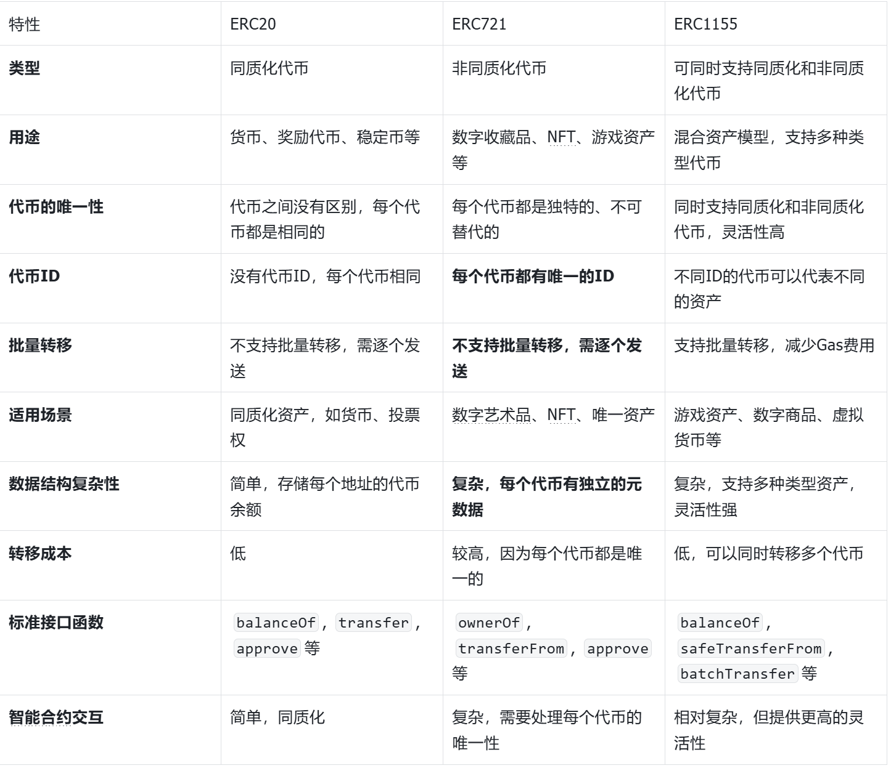
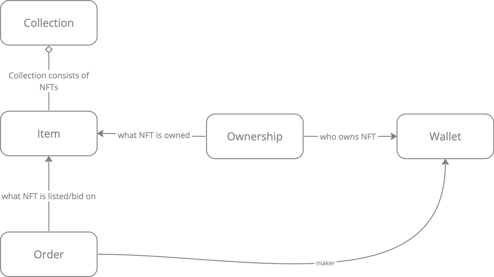

# NFTmarket-contract

## NFT 基本概念



## NFT 的核心操作

详见：[https://eips.ethereum.org/EIPS/eip-721 ] (<https://eips.ethereum.org/EIPS/eip-721>)

1. **transfer**

    - `safeTransferFrom(address _from, address _to, uint256 _tokenId)`</br>
    安全转移资产，校验对方是否是合约，如果是合约必须实现ERC721
    - `transferFrom(address _from, address _to, uint256 _tokenId)`

2. **approve**

    - `approve(address _approved, uint256 _tokenId)`
    - `setApprovalForAll(address _operator, bool _approved)`

## NFT 数据模型

**Collection：** NFT 集合的实体</br>
**Item：** 代表交易系统中代表 NFT 的实体</br>
**Ownership：**  代表 NFT 的所有权，也就是 Item 的 Owner， 即 Item 和 Wallet 的关联关系</br>
**Order：** 代表出售或购买 NFT 意愿的实体。</br>
**Activity：** 代表 NFT 状态下发生的事件：mint, transfer, list, buy 等</br>



## NFT 交易模式

- **NFT 订单在链下**: 非dex
- **NFT 订单在链上**: dex
- **订单簿 OrderBook**: Maker, Taker: 用户; 价格确定于订单
- **做市商 AMM**: ERC721——AMM: Maker，Taker: 一方是池子，一方是用户，价格是随池子变化的

## 合约核心

基于智能合约实现基于订单簿模型的 NFT 交易系统, 即能够支持以下写入操作和查询操作。

### 1. 写入操作

链上订单簿(OrderBook DEX)支持 create limit sell/buy, market sell/buy order, edit(cancel&create)/cancel order 功能。

- limit sell order
- limit buy order
- market sell order
- market buy order
- edit/cancel order

### 2. 查询操作

- 支持从链上查询订单（包括已经过期订单）

## 合约构成

- OrderBookExchange 实现完整的订单簿交易逻辑
  - OrderStorage 用于存储订单信息的模块
  - OrderValidator 用于处理订单逻辑验证的模块
  - ProtocolManager 用于管理协议费的模块
  - ...
- OrderVault 独立存储订单相关资产的模块

## 运行准备

### 1. 安装依赖

```shell
npm install
```

### 2. 设置 .env

复制 .env.example 为 .env，填写所需配置。</br>

测试网

- SEPOLIA_ALCHEMY_AK
- SEPOLIA_PK_ONE
- SEPOLIA_PK_TWO

主网

- MAINNET_PK
- MAINNET_SIGNER_PK
- MAINNET_ALCHEMY_AK

### 3. 编译合约

```shell
npx hardhat compile
```

### 4. 测试合约

```shell
npx hardhat test
```

### 5. 部署合约

部署交易合约

```shell
npx hardhat run --network sepolia scripts/deploy.js
```

部署NFT合约

```shell
npx hardhat run --network sepolia scripts/deploy_721.js
```

## 高级功能

获取合约大小

```shell
npx hardhat size-contracts
```

查看合约存储布局

```shell
slither-read-storage ./contracts/EasySwapOrderBook.sol --contract-name EasySwapOrderBook --solc-remaps @=node_modules/@ --json storage_layout.json
```

see more [slither](https://github.com/crytic/slither)
