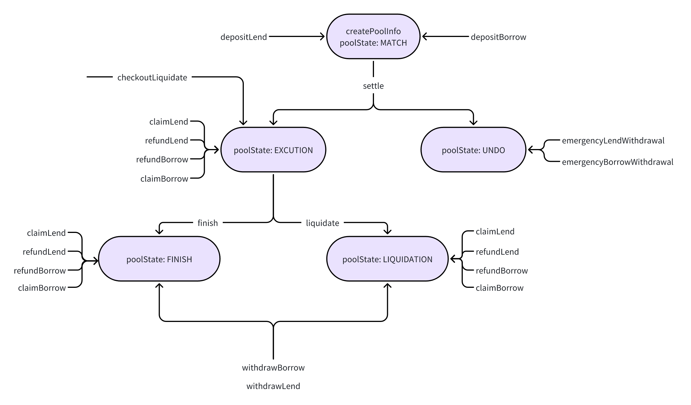

# Pledge系统文档

- **pledge-doc：** 合约文档
- **pledge-contract：** 合约代码
- **pledge-go：** 后端代码
- **pledge-web：** 前端代码

## 系统概述

借贷是Defi领域非常重要的模块，Maker、Aave、Compound是当前借贷领域的三巨头。  
Maker: 抵押资产获取稳定币DAI  [详情](https://docs.makerdao.com/smart-contract-modules/dai-module)  
Aave: 加密货币借贷协议  [详情](https://aave.com/docs/developers/smart-contracts)  
Compound: 加密货币借贷协议  [详情](https://docs.compound.finance/#protocol-contracts)  
Pledge 是一个去中心化金融（DeFi）项目，旨在提供固定利率的借贷协议，主要服务于加密资产持有者。Pledge 旨在解决 DeFi 借贷市场中缺乏固定利率和固定期限融资产品的问题。传统的 DeFi 借贷协议通常采用可变利率，主要服务于短期交易者，而 Pledge 则专注于长期融资需求。

## 功能需求

### 1 核心功能

- **固定利率借贷：** Pledge 提供固定利率的借贷服务，减少利率波动带来的风险。
- **去中心化 Dex 交易：** 核心。

### 2 主要角色

- **贷款人（Lend）：** 提供流动性，获得固定回报。
- **借款人（Rorrow）：** 可以抵押加密资产以获得稳定币，用于投资非加密资产。

### 3 关键组件

- **智能合约：** 自动执行借贷协议，确保交易记录上链且不可篡改。
- **pToken/jToken：** 代表未来时间点的价值转移，用于借贷和清算。

## 代码分析

PledgePool.sol 是 Pledge 项目的核心智能合约之一。

### 1 Pool

- **创建和管理借贷池：** 包括设置借贷池的基本信息、状态管理等。
  - createPoolInfo 创建借贷池，初始化借贷池基本信息（MATCH）。
  - setFee 修改费率。
  - setFeeAddress 修改交易费接收地址。
  - setSwapRouterAddress 修改dex交易所地址。
  - setMinAmount 修改最小金额。
  - poolLength 查询借贷池长度。
  - getPoolState 查询借贷池状态。
- **用户存款和取款：** 处理用户的借款和贷款操作，包括存款、取款等。
  - depositLend 贷款人添加贷款。
  - depositBorrow 借款人添加借款。
  - claimLend 领取贷款所得SP。
  - refundLend 退还过量贷款给存款人。
  - withdrawLend 存款人取回本金和利息。
    1. burn SP代币。
    2. 根据SP份额赎回资金和利息。
  - emergencyLendWithdrawal 紧急贷款贷款，池状态必须是未完成。
  - claimBorrow 领取借款所得JP和贷款资金。
  - refundBorrow 退还过量借款的抵押给借款人。
  - withdrawBorrow 借款人提取剩余的保证金。
    1. burn JP代币。
    2. 根据JP份额赎回剩余的保证金。
  - emergencyBorrowWithdrawal 紧急借款提取，池状态必须是未完成。
- **自动结算和清算：** 根据设定时间和阈值自动结算和清算，保护借贷双方的利益。
  - checkoutSettle 校验是否可以结算。
  - settle 结算，根据借贷款信息，判断借贷池是否成立。
    1. 成立：修改借贷池状态为 执行中（EXECUTION），计算结算时总借款与总贷款。
    2. 不成立：修改借贷池状态为 未完成（UNDONE），借贷方通过emergencyLendWithdrawal、emergencyBorrowWithdrawal取回资产。
  - checkoutFinish 校验是否可以完成，如果达到完成时间返回true否则false。
  - finish 借贷池到达完成时间，完成借贷池（FINISH）。
    1. 计算利率。
    2. 计算贷款费用。
    3. 通过交易所，售卖借款抵押，换取 贷款+利率+费用 金额的贷款货币。
    4. 售卖货币是否够支付 贷款+利率 的货币，够：多余货币支付费用； 相等：不支付交易费用； 不够：回滚；
    5. 计算剩余借款抵押。
    6. 扣减借款费用。
    7. 记录完成时资金信息。
    8. 更新池子状态。
  - checkoutLiquidate 检查是否可以清算，如果借款价值小于贷款价值最小阈值返回true否则false。
  - liquidate 借款货币价值跌至阈值，清算借贷池（LIQUIDATION）。
    1. 计算利率。
    2. 计算贷款费用。
    3. 通过交易所，售卖借款抵押，换取 贷款+利率+费用 金额的贷款货币。
    4. 售卖货币是否够支付 贷款+利率 的货币，够：多余货币支付费用； 相等：不支付交易费用； 不够：回滚；
    5. 计算剩余借款抵押。
    6. 扣减借款费用。
    7. 记录清算时资金信息。
    8. 更新池子状态。
- **费用管理：** 设置和管理借贷费用，确保平台的可持续运营。

  

## 事件和函数

- **事件：** 如 DepositLend、RefundLend、ClaimLend 等，用于记录用户操作。
- **函数：** 如 DepositLend、refundLend、claimLend 等，实现具体的业务逻辑。
